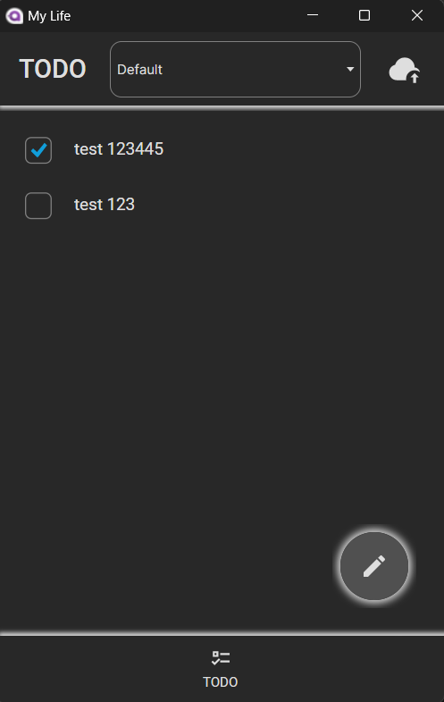
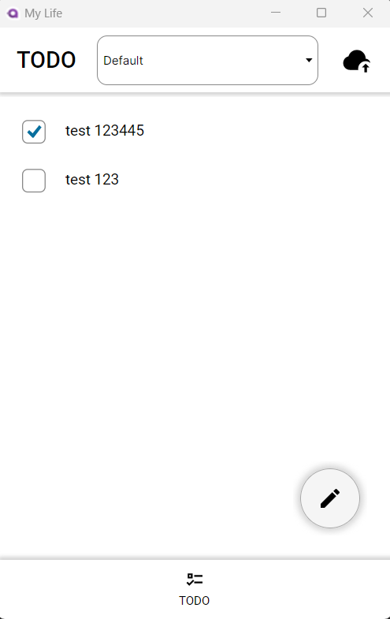

# MyLife

Cross-platform real life management tool.

**[!] Warning! Project is work-in-progress. See "Current limitations" below.**

## Screenshots

### Desktop app
 

## Features

- TODO: Add/remove/check, support for multiple lists, cloud sync
- Notes: Google Keep-style quick notes
- Hub: Just-in-time information, similar to Google Now
- Services: finance management, shopping cart, weather, notes, utility bills tracking, and so on
- Tools: Useful utilities for performing quick actions (calculator, unit converter and others)
- Support for light and dark themes
- ...and more soon!

## Platforms & requirements

Client app:
- Windows 10 and later
- Linux (tested on Debian and derived distributions)
- Android (14 and later, WearOS 4 and later)

Server and infrastructure **(TBD)**:
- Windows 10 and later
- Linux (Docker Compose config included)
- CouchDB required (see supported version in *docker-compose.yml*)

## Current limitations (important!):
- Only basic TODO implementation
- No data persistence or cloud sync
- Web version is not operational
- Backend is not available yet, only client apps

## Building and running

*Detailed instructions coming soon!*

1. Clone repo to a local directory
2. Open src/MyLife.sln, select preferred platform-specific project:
	- Android: App/Android/MyLife.App.Android (mobile & watch)
	- Desktop: App/MyLife.App.Desktop
	- Web: App/MyLife.App.Web
3. Build selected project and run
	- for Android, make sure to either have an emulator installed and AVD available, 
	  or connect a physical device to the development machine.
